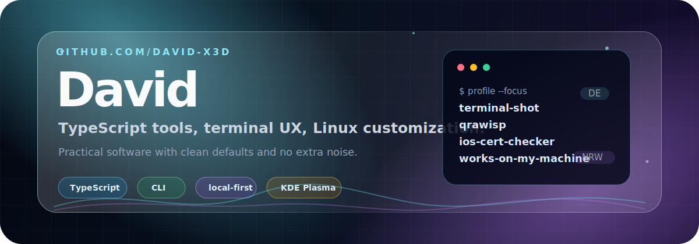

  

<h1 align="center">David</h1>

  Developer from Germany, NRW. I build practical TypeScript tools, terminal-first utilities, clean interfaces, and Linux desktop experiments.

  
  
  

## What I Build

- Small CLI tools that make confusing developer workflows easier to understand.
- Terminal utilities with clean output, sensible defaults, and local-first behavior.
- TypeScript projects that prioritize practical UX over framework noise.
- KDE Plasma and Linux desktop customizations with a polished glass-style look.

## Featured Work

| Project | What it does | Stack |
| --- | --- | --- |
| [`terminal-shot`](https://github.com/david-x3d/terminal-shot) | Beautiful terminal screenshots from text, commands, and ANSI output. | TypeScript, CLI, ANSI |
| [`qrawisp`](https://github.com/david-x3d/qrawisp) | Fast QR codes from your terminal. | TypeScript, terminal UX |
| [`ios-cert-checker`](https://github.com/david-x3d/ios-cert-checker) | Privacy-first local CLI for inspecting iOS signing certificates and provisioning profiles. | TypeScript, iOS tooling |
| [`works-on-my-machine`](https://github.com/david-x3d/works-on-my-machine) | A tiny CLI that explains why a repo works somewhere else but not locally. | TypeScript, diagnostics |
| [`kde-plasma-liquid-glass-theme`](https://github.com/david-x3d/kde-plasma-liquid-glass-theme) | KDE Plasma Liquid Glass setup inspired by macOS Tahoe. | Shell, KDE, Linux |

## Toolbox

  
  
  
  
  
  
  
  

## Current Focus

- Turning small CLI ideas into reliable, installable tools.
- Keeping developer workflows local, transparent, and easy to debug.
- Building interfaces that feel sharp without adding unnecessary complexity.
- Tweaking Linux desktops until they feel personal.

## GitHub Snapshot

  
  

